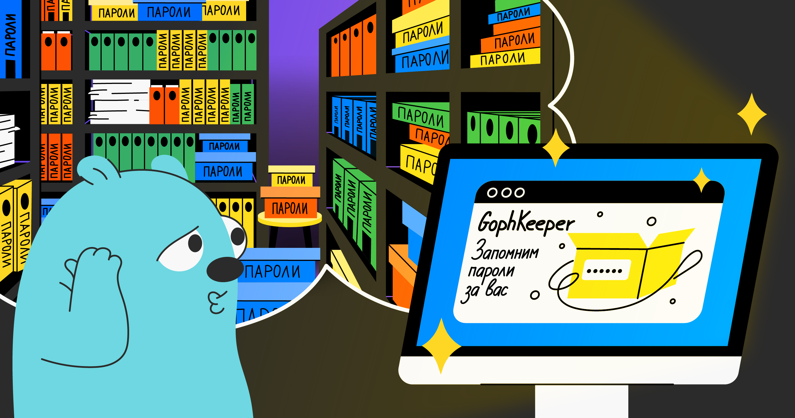

# GophKeeper



GophKeeper представляет собой клиент-серверную систему, позволяющую пользователю надёжно и безопасно хранить логины, пароли, бинарные данные и прочую приватную информацию.

---

# Инструкции

## Сборка клиента
```shell
go build ./cmd/client/main.go -o client.exe
```
---
## Запуск Сервера
Докера тут нет, так что придется создать у себя postgre базу gophkeeper.  
После чего запустить сервер с указанием своего конфига, в том числе URI для базы.
Пример есть в ./config/local.yaml  
```shell
go run ./cmd/keeper/main,go --config=path/to/config.yaml
```
---
## Линтеры

Если понадобятся линтеры, инструкция для них лежи в **golangci_README.md**

## Тест  
  
```shell
go test -v ./...
```